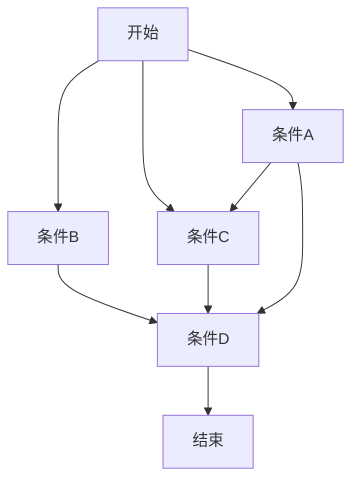
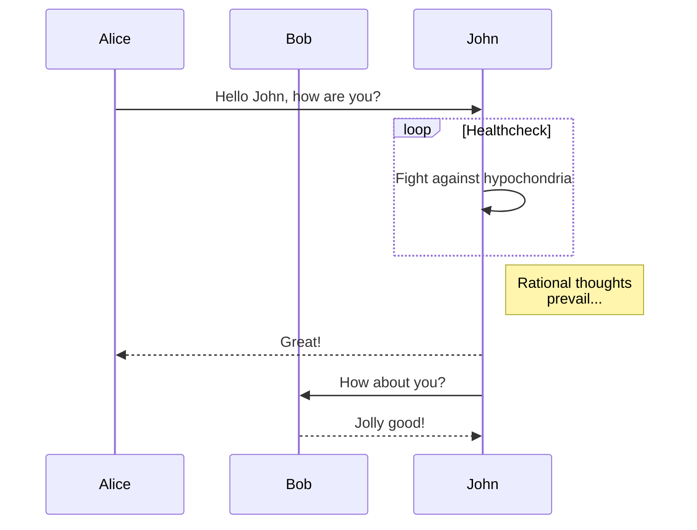
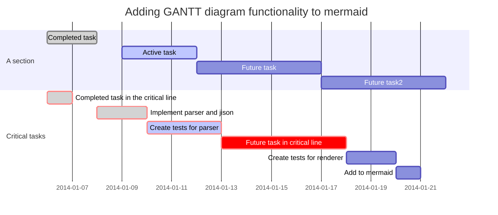
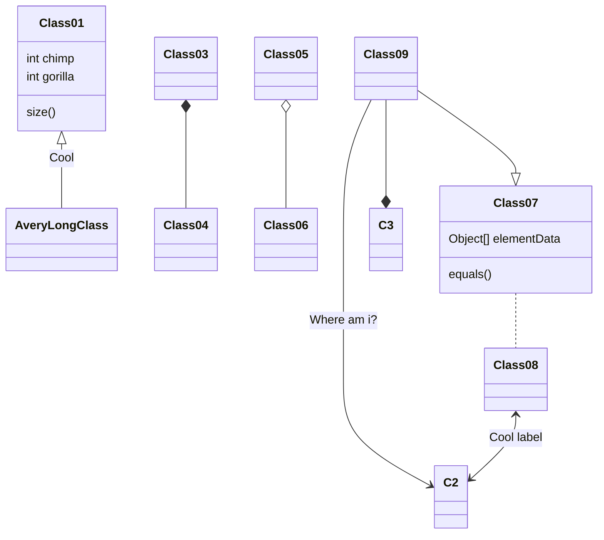
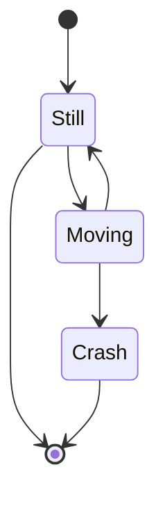
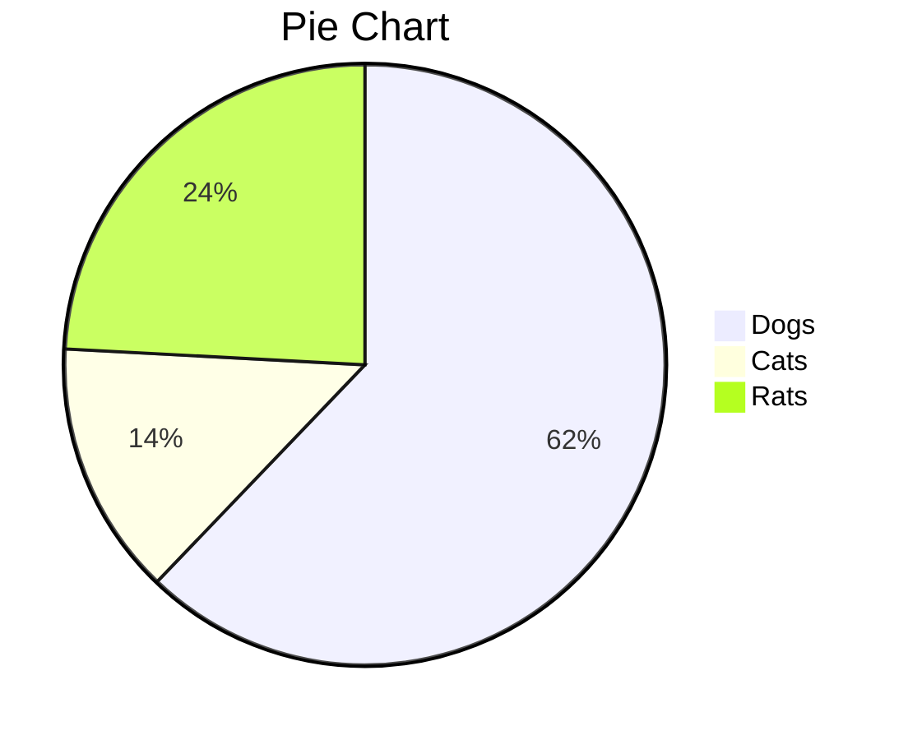

# Markdown —— 一款轻量级标记语言

[TOC]

## 介绍

Markdown是一种可以使用普通文本编辑器编写的==**标记语言**==，通过简单的标记语法，它可以使普通文本内容具有一定的格式。

## 常用语法

| 效果       | Markdown           | 快捷键             |
| :--------- | :----------------- | :----------------- |
| 粗体       | `**text**`         | Ctrl/⌘ + B         |
| 斜体       | `*text*`           | Ctrl/⌘ + I         |
| 超链接     | `[title](http://)` | Ctrl/⌘ + K         |
| 内嵌代码   | `` `code` ``       | ⌃ + `              |
| 图片       | ``  | Ctrl/⌘ + Shift + I |
| 列表       | `* item`           | Ctrl + L           |
| Blockquote | `> quote`          | Ctrl + Q           |
| 一级标题   | `# title`          | ⌘ + 1              |
| 二级标题   | `## title`         | ⌘ + 2              |
| 三级标题   | `### title`        | ⌘ + 3              |

## 更多语法

> 图片展示及快捷键来自 `Typora` ，在不同地方可能存在差异

### 标题

| 效果     | 语法           | 快捷键 |
| -------- | -------------- | ------ |
| 一级标题 | `# title`      | ⌘ + 1  |
| 二级标题 | `## title`     | ⌘ + 2  |
| 三级标题 | `### title`    | ⌘ + 3  |
| 四级标题 | `#### title`   | ⌘ + 4  |
| 五级标题 | `##### title`  | ⌘ + 5  |
| 六级标题 | `###### title` | ⌘ + 6  |


### 字体

> 不同效果可搭配使用

| 效果   | 语法                 | 快捷键     |
| ------ | -------------------- | ---------- |
| 粗体   | `**text**`           | Ctrl/⌘ + B |
| 斜体   | `*text*` 或 `_text_` | Ctrl/⌘ + I |
| 删除   | `~~text~~`           | ⌃ + ⇧ + `  |
| 下划线 | `<u>test</u>`        | Ctrl/⌘ + U |

**粗体**	*斜体*	~~删除~~	<u>下划线</u>	***粗斜体***	***~~粗斜删除~~***	***~~<u>粗斜体删除下划</u>~~***

### 列表

> 可嵌套使用，==缩进 4 个空格==

| 效果     | 语法                                           | 快捷键    |
| -------- | ---------------------------------------------- | --------- |
| 无序列表 | `* list` 或 `- list` 或 `+ list`               | ⌥ + ⌘ + U |
| 有序列表 | `1. liist`                                     | ⌥ + ⌘ + O |
| 任务列表 | 未选中：`- [ ] list`<br />已选中：`- [x] list` | ⌥ + ⌘ + X |

- list
    1. list
    2. list
        - [ ] list

+ list

* list

### 代码

| 效果     | 语法                                                        | 快捷键             |
| -------- | ----------------------------------------------------------- | ------------------ |
| 内嵌代码 | `` `code` ``                                                | ⌃ + `              |
| 代码块   | ` ```java ` 或  `~~~java` <br />code<br />` ``` ` 或 ` ~~~` | Ctrl/⌘ + Alt/⌥ + C |

`code`	

```c++
print("hello world");
```

~~~java
System.out.println("hello world");
~~~

### 链接

| 效果             | 语法                             | 快捷键             |
| ---------------- | -------------------------------- | ------------------ |
| 超链接           | `[title](http://)` 或`<http://>` | Ctrl/⌘ + K         |
| 图片（标题可选） | ``        | Ctrl/⌘ + Shift + I |

[示例超链接](https://www.jeson.club/)	<https://www.jeson.club/>


### 表格

| 效果 | 语法                                                         |
| ---- | ------------------------------------------------------------ |
| 表格 | 表头：`| 左对齐  |  右对齐 | 居中对齐 |`<br />格式：`| ------- | ------: | :------: |`<br />内容`| content | content | content  |` |

| 左对齐  |  右对齐 | 居中对齐 |
| ------- | ------: | :------: |
| content | content | content  |

> 更多表格相关内容请参考[官方文档](http://support.typora.io/Table-Editing/)

###  其他

> 更多 `emoji` 参考[对照表](https://www.webfx.com/tools/emoji-cheat-sheet/)

| 效果             | 语法                                                     | 快捷键    |
| ---------------- | -------------------------------------------------------- | --------- |
| 分割线           | `—--` 或 `~~~` 或 `___`                                  | ⌥ + ⌘ + - |
| 块引用（可嵌套） | `> quote`                                                | ⌥ + ⌘ + Q |
| 目录             | `[TOC]`                                                  |           |
| 脚注             | 声明脚注：`text[^text1]`<br />定义脚注：`[^text1]:text2` | ⌥ + ⌘ + R |
| Emoji 表情       | `:smile:`                                                |           |
| 转义字符         | `\ + 符号` 或 使用空格分割                               |           |

------

> quote

text[^脚注] 

:smile:

[^脚注]: 脚注描述

## Markdown 扩展语法

### 常用扩展语法

> 扩展语法不是所有地方都支持，`Typora` 支持以下所有语法

| 效果     | 语法                               | 快捷键    |
| -------- | ---------------------------------- | --------- |
| 上标     | `y = x^2^`                         |           |
| 下标     | `H~2~o`                            |           |
| 高亮     | `==key==`                          | ⇧ + ⌘ + H |
| 内联公式 | `$lim_{x \to \infty} \ exp(-x)=0$` | ⌥ + ⌘ + B |


> 更多表达式相关内容请参考[官方文档](http://support.typora.io/Math/)

### 图表

> 这里仅做展示，更多图表相关内容请参考[官方文档](http://support.typora.io/Draw-Diagrams-With-Markdown/)

#### 流程图（Flowchart）

```
st=>start: Start:>http://www.google.com[blank]
e=>end:>http://www.google.com
op1=>operation: My Operation
sub1=>subroutine: My Subroutine
cond=>condition: Yes
or No?:>http://www.google.com
io=>inputoutput: catch something...

st->op1->cond
cond(yes)->io->e
cond(no)->sub1(right)->op1
```

```flow
st=>start: Start:>http://www.google.com[blank]
e=>end:>http://www.google.com
op1=>operation: My Operation
sub1=>subroutine: My Subroutine
cond=>condition: Yes
or No?:>http://www.google.com
io=>inputoutput: catch something...

st->op1->cond
cond(yes)->io->e
cond(no)->sub1(right)->op1
```

#### 流程图（Mermaid）

```
graph TD;
    开始-->条件B;
    条件A-->条件C;
    条件B-->条件D;
    条件C-->条件D;
    条件A-->条件D;
    开始-->条件C;
    开始-->条件A;
    条件D-->结束;
```



#### 时序图（Mermaid）

```
sequenceDiagram
    participant Alice
    participant Bob
    Alice->>John: Hello John, how are you?
    loop Healthcheck
        John->>John: Fight against hypochondria
    end
    Note right of John: Rational thoughts <br/>prevail...
    John-->>Alice: Great!
    John->>Bob: How about you?
    Bob-->>John: Jolly good!
```



#### 时序图（Sequence）

```
Alice->>John: Hello John, how are you?
Note right of John: Rational thoughts
John-->>Alice: Great!
John->>Bob: How about you?
Bob-->>John: Jolly good!
```

```sequence
Alice->>John: Hello John, how are you?
Note right of John: Rational thoughts
John-->>Alice: Great!
John->>Bob: How about you?
Bob-->>John: Jolly good!
```

#### 甘特图（Mermaid）

```
gantt
        dateFormat  YYYY-MM-DD
        title Adding GANTT diagram functionality to mermaid
        section A section
        Completed task            :done,    des1, 2014-01-06,2014-01-08
        Active task               :active,  des2, 2014-01-09, 3d
        Future task               :         des3, after des2, 5d
        Future task2               :         des4, after des3, 5d
        section Critical tasks
        Completed task in the critical line :crit, done, 2014-01-06,24h
        Implement parser and jison          :crit, done, after des1, 2d
        Create tests for parser             :crit, active, 3d
        Future task in critical line        :crit, 5d
        Create tests for renderer           :2d
        Add to mermaid                      :1d
```



#### 类图（Mermaid）

```
classDiagram
Class01 <|-- AveryLongClass : Cool
Class03 *-- Class04
Class05 o-- Class06
Class07 .. Class08
Class09 --> C2 : Where am i?
Class09 --* C3
Class09 --|> Class07
Class07 : equals()
Class07 : Object[] elementData
Class01 : size()
Class01 : int chimp
Class01 : int gorilla
Class08 <--> C2: Cool label
```



#### 状态图（Mermaid）

```
stateDiagram
    [*] --> Still
    Still --> [*]

    Still --> Moving
    Moving --> Still
    Moving --> Crash
    Crash --> [*]
```



#### 饼图（Mermaid）

```
pie
    title Pie Chart
    "Dogs" : 386
    "Cats" : 85
    "Rats" : 150 
```

